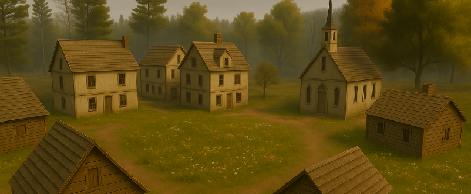
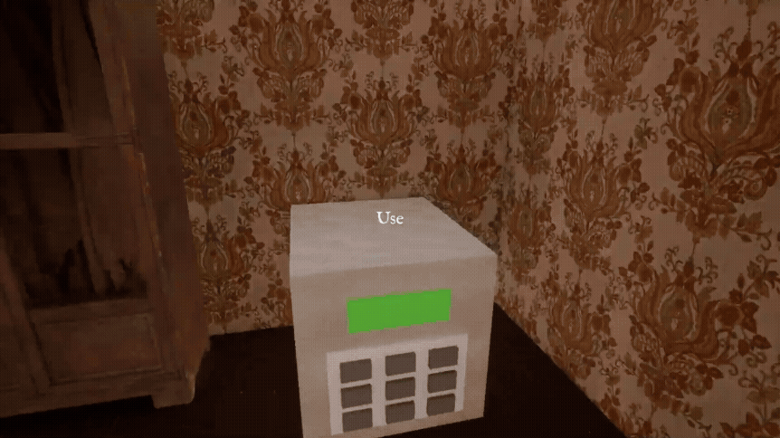
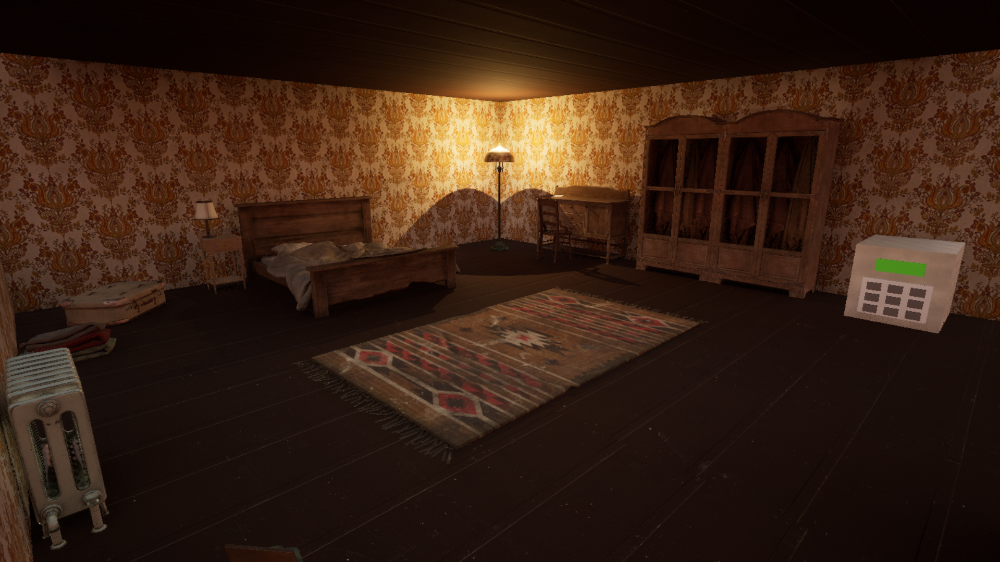
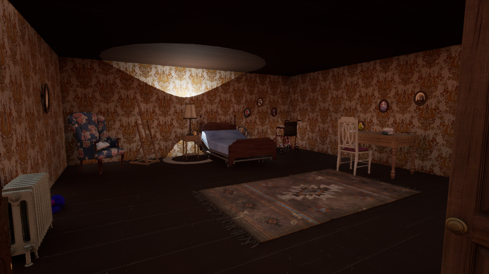
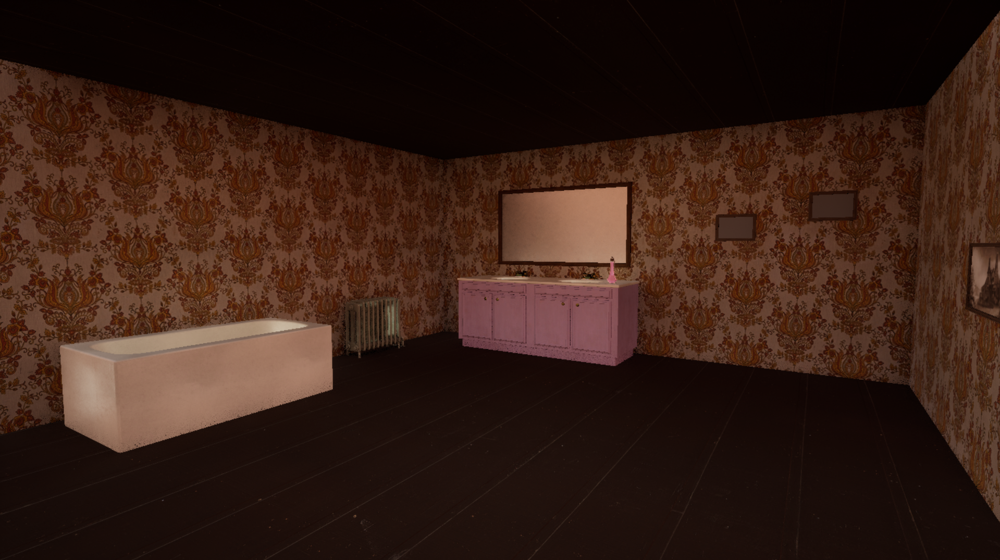
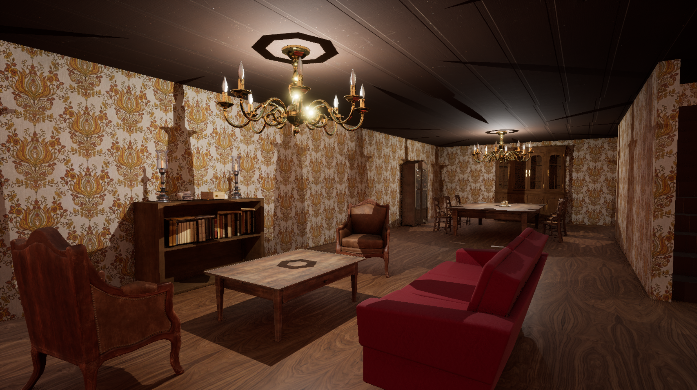
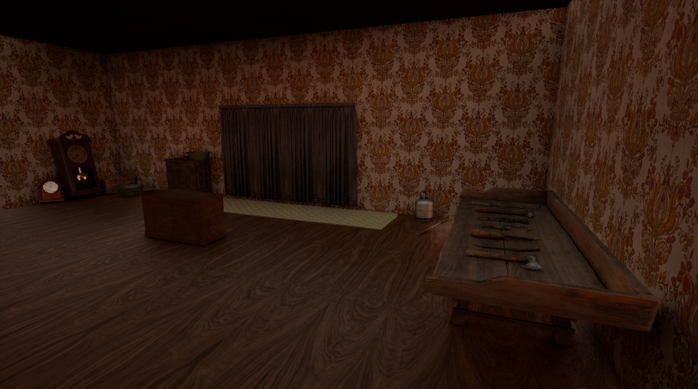
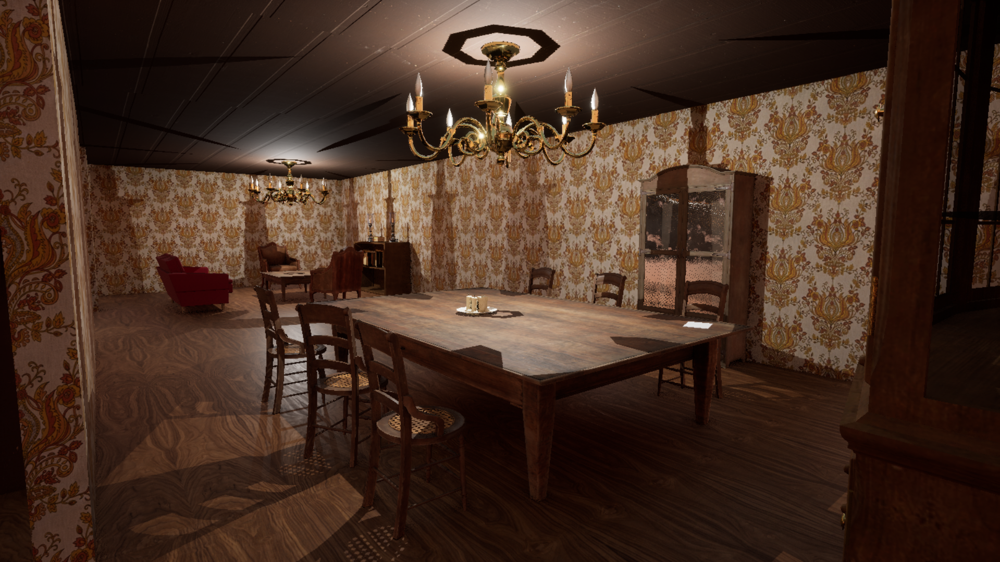

# Infirm
## 📜 Description
**Infirm** is a first-person exploration and puzzle game set in a mysterious, abandoned house. Players must carefully explore the environment, interact with objects, and solve puzzles to uncover the secrets hidden within. Each room holds clues, and each item could bring you closer to the truth.

## 🖥️ Development
**Infirm** was developed as a single-player experience with a focus on creating an eerie, atmospheric world inspired by Colonial Massachusetts in the 1600s. While much of the setting draws from that time, small details such as unusual objects and modern conveniences, quietly disrupt the sense of place, leaving the player to question when, exactly, the story is meant to unfold.

The game was built using **Unreal Engine 5** and developed entirely in **C++**, the project came to life through careful iteration and steady refinement. The process involved shaping freely available assets and weaving them together into a cohesive world that feels both grounded and quietly unsettling. Progress often had to find its place alongside other commitments, but the vision remained clear throughout.

---
## 🎮 Gameplay
### Playthrough
🎥 Watch the gameplay on YouTube [here](https://www.youtube.com/watch?v=xlBb9Ggb-xQ)! 

### Screenshots

## 📦 Download 
Click [here](https://drive.google.com/drive/u/1/folders/1J4NOSFp35yeTLK3PGWlECyoCejMM9fZR) to download the game!

### Steps To Download
1. Click the link highlighted above
2. Download the zip folder 
3. Unzip the folder and navigate to the Windows folder
4. Open Infirm.exe and enjoy!

## 🛠️ Credits
### 🎵 Music
**Main Menu Theme:** "Scott Buckley - Balefire" is under a Creative Commons (BY 3.0) license:
https://creativecommons.org/licenses/... \
[musicbyscottb](https://www.youtube.com/user/musicbyscottb) \
Music powered by BreakingCopyright: [🔥 Dark Celtic Soundtrack (Free Music) ](https://www.youtube.com/watch?v=ln3k6NOLcJs)- "B...   
 \
**Ending Theme:** Relaxation and Meditation Nation - "Eerie Cornfield Soundscape Halloween Ambience Sounds/ Rustling Cornstalks Ravens Crows ASMR / 1 Hour". \
Link:  https://www.youtube.com/watch?v=VGgk3Kwq1vw. \
Author: [Relaxation and Meditation Nation](https://www.youtube.com/@relaxationmeditationnation)
